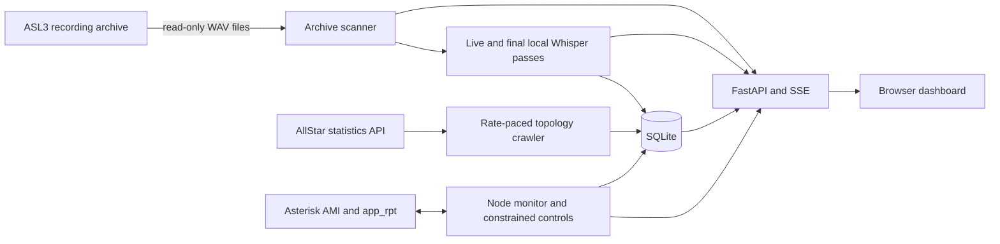

<p align="center">
  
</p>

# Repeater Scribe

Repeater Scribe is a self-hosted operations dashboard for AllStarLink 3 nodes.
It combines live Asterisk/app_rpt monitoring and control, local AI transcription
of repeater recordings, favorite-node statistics, and interactive AllStar
network discovery in one web application.

It runs alongside an ASL3 node rather than replacing it. The recording archive
is always mounted read-only. Node commands are optional and travel through a
separately enabled Asterisk Manager Interface (AMI) connection.

Version `0.5.1` is local-first: audio transcription uses `faster-whisper` on the
machine running Repeater Scribe. No OpenAI or other hosted transcription backend
is implemented in this release.

## What it does

### Operates an AllStar node

- Maintains one backend-owned AMI connection instead of opening a connection for
  every browser.
- Displays AMI health, direct app_rpt links, connection modes, and the station
  currently transmitting.
- Reconciles event-driven state with `RptStatus XStat` and `SawStat`, with an
  `RPT_ALINKS` fallback for older app_rpt installations.
- Connects nodes in transceive, monitor, local-monitor, and permanent modes.
- Disconnects one or all links and requests reconnects.
- Provides named commands for announcements, time, ID, node/link status, IAX
  status, network status, and uptime.
- Accepts validated AllStar DTMF function strings when raw function access is
  explicitly enabled with AMI control.
- Waits for refreshed node state after connection commands instead of treating
  AMI command acceptance as proof that the link changed.

### Transcribes radio traffic locally

- Discovers `.wav` and `.wav49` recordings recursively without modifying the
  ASL3 archive.
- Produces provisional text while a recording is still growing by decoding
  rolling FFmpeg tail snapshots.
- Runs a new beginning-to-end accuracy pass after the source file is stable.
- Uses one shared `faster-whisper` model for live and final work and serializes
  inference to avoid competing copies in GPU memory.
- Preserves the model's raw text and stores a separate callsign-corrected display
  transcript.
- Builds callsign context from configured calls, favorites, live node activity,
  and discovered topology data.
- Decodes phonetic callsigns and conservatively repairs split suffixes,
  number-slot mistakes, and locally relevant near-matches.
- Searches completed and provisional transcripts, streams updates through SSE,
  and plays the original archive audio from the dashboard.

The supplied deployment profile uses `large-v3`, CUDA FP16, beam 1 for live
snapshots, and beam 5 for completed recordings. See
[AI transcription](docs/transcription.md) for the exact pipeline, callsign
logic, benchmarks, CPU fallback, tuning, and current limitations.

### Explores the AllStar network

- Stores favorite nodes with operator-supplied callsign, description, location,
  grouping, ordering, and connection preferences.
- Combines live AMI state with locally observed key-up counts and transmit time.
- Polls the public AllStar statistics API for numeric favorites, including
  directory metadata, activity, keying, uptime, and reported links.
- Runs a persistent breadth-first crawl from favorite roots to discover their
  observable connected component. It does not attempt to scrape every AllStar
  node globally.
- Caches crawl work, node snapshots, and one-sided or two-sided edges in SQLite,
  allowing discovery to resume after a restart.
- Streams crawl progress into an interactive network map with pan, zoom, fit,
  draggable nodes, automatic layout, link-confidence styling, live AMI state,
  and node controls.
- Bounds discovery by configurable node and depth limits and paces all public
  statistics requests through one scheduler.

### Provides a live operations workspace

- Dockable, collapsible, and movable dashboard windows with saved layouts.
- Queue, node status, connected-node, favorite, network-map, control,
  transcript, activity, function, and command-output panels.
- Activity-aware favicon and dashboard emblem states for idle, transcribing,
  node-keyed, and keyed-plus-transcribing operation.
- Server-Sent Events for archive jobs, node state, key transitions, and topology
  progress.
- SQLite persistence for ingestion jobs, final transcripts, favorites, node
  statistics, and topology discovery.

## System overview



The archive path is read-only, but Repeater Scribe itself is not a read-only
application when AMI control is enabled. It can issue real app_rpt commands to
the configured node.

## Operating modes

| Mode | Configuration | Behavior |
| --- | --- | --- |
| Transcription only | `ASLT_AMI_ENABLED=false` | Scans and transcribes the archive; node status and controls are unavailable. |
| Monitor | `ASLT_AMI_ENABLED=true`, `ASLT_AMI_CONTROL_ENABLED=false` | Adds live node/link/key state without allowing control commands. |
| Control | Both AMI settings `true` | Enables trusted-network dashboard control and API-key-protected node-control routes. |

Public favorite statistics and topology crawling are independently controlled
by `ASLT_FAVORITE_STATS_ENABLED`.

## Requirements

- Docker Engine with Docker Compose v2.
- An ASL3 recording archive visible on the Docker host.
- An existing Docker network shared with the ASL3/Asterisk container when AMI
  monitoring or control is used.
- AMI credentials permitted to receive events and execute the fixed `Command`
  actions used by Repeater Scribe.
- Persistent space for SQLite and Whisper model files.
- For the supplied GPU profile: a compatible NVIDIA driver, NVIDIA Container
  Toolkit, and approximately 12 GB VRAM.

The Compose file requests a GPU with `gpus: all`. CPU-only users must remove or
override that Compose setting in addition to selecting the CPU model profile
described below.

## Quick start

### 1. Prepare the configuration

```bash
git clone https://github.com/azcoigreach/repeater-scribe.git
cd repeater-scribe
cp .env.example .env
```

At minimum, set the host archive path:

```dotenv
ASLT_HOST_ARCHIVE_PATH=/absolute/path/to/asl_monitor
```

For node monitoring and control, also configure the shared Docker network and
AMI values. Replace every placeholder; Repeater Scribe intentionally ships with
no node ID default.

```dotenv
ASL3_NETWORK_NAME=asl3-docker_default
ASLT_AMI_ENABLED=true
ASLT_AMI_HOST=allstarlink3
ASLT_AMI_PORT=5038
ASLT_AMI_USERNAME=admin
ASLT_AMI_SECRET=replace-with-ami-secret
ASLT_AMI_NODE_ID=YOUR_NODE_ID
ASLT_AMI_CONTROL_ENABLED=true
ASLT_API_KEY=replace-with-a-long-random-secret
ASLT_KNOWN_CALLSIGNS=YOURCALL,CLUBCALL
```

The external network named by `ASL3_NETWORK_NAME` must already exist. The
Asterisk container and Repeater Scribe must both be attached to it, and
`ASLT_AMI_HOST` must resolve from that network. If no suitable network exists,
create one and attach the Asterisk container before starting Repeater Scribe.

```bash
docker network create asl3-docker_default
```

Do not run that command when the network already exists.

### 2. Start Repeater Scribe

```bash
docker compose up -d --build
docker compose ps
docker compose logs --tail 100 repeater-scribe
```

Open <http://localhost:8088>.

The service can become healthy before Whisper has been loaded. The first
transcription may download `large-v3` into `./data/models/whisper` and will take
longer than later passes.

### 3. Verify the GPU and configured profile

```bash
docker compose exec -T repeater-scribe nvidia-smi
curl http://localhost:8088/api/v1/system/info
```

Benchmark a real completed recording:

```bash
docker compose run --rm repeater-scribe \
  asl-transcriber benchmark /audio/YOUR_NODE_ID/example.wav
```

A reported real-time factor below `1.0` means the final pass completed faster
than the audio duration.

## CPU-only profile

Remove or override `gpus: all` in `docker-compose.yml`, then use a CPU profile in
`.env`:

```dotenv
ASLT_WHISPER_MODEL=medium.en
ASLT_WHISPER_DEVICE=cpu
ASLT_WHISPER_COMPUTE_TYPE=int8
```

`large-v3` can run on a CPU, but it is unlikely to maintain near-live latency on
typical machines. Actual performance depends on the processor and recording
quality; benchmark representative repeater audio before choosing a model.

## Important configuration

### Archive and transcription

| Setting | Purpose |
| --- | --- |
| `ASLT_HOST_ARCHIVE_PATH` | Host directory mounted read-only at `/audio`. |
| `ASLT_ARCHIVE_PATHS` | One or more archive roots inside the container. |
| `ASLT_ARCHIVE_POLL_SECONDS` | Archive discovery/final-processing interval. |
| `ASLT_FILE_STABILIZATION_SECONDS` | Required unchanged interval before a final pass. |
| `ASLT_AUTO_PROCESS` | Automatically process stable pending recordings. |
| `ASLT_LIVE_TRANSCRIPTION` | Enable provisional growing-file transcription. |
| `ASLT_WHISPER_MODEL` | Local model identifier or model path. |
| `ASLT_WHISPER_DEVICE` | `cuda` or `cpu`. |
| `ASLT_WHISPER_COMPUTE_TYPE` | CTranslate2 precision or quantization mode. |
| `ASLT_KNOWN_CALLSIGNS` | Comma-separated high-priority local callsigns. |

The full transcription setting reference is in
[docs/transcription.md](docs/transcription.md).

### AMI monitoring and control

| Setting | Purpose |
| --- | --- |
| `ASLT_AMI_ENABLED` | Start persistent AMI monitoring. |
| `ASLT_AMI_HOST` / `ASLT_AMI_PORT` | Asterisk Manager endpoint reachable from the container. |
| `ASLT_AMI_USERNAME` / `ASLT_AMI_SECRET` | Server-side AMI credentials; never exposed to the browser. |
| `ASLT_AMI_NODE_ID` | Required home-node ID. No real node is hardcoded. |
| `ASLT_AMI_CONTROL_ENABLED` | Permit the constrained node-control routes. |
| `ASLT_AMI_RECONCILE_SECONDS` | Periodic state-repair interval. |
| `ASLT_API_KEY` | Required in `X-API-Key` for node-control and favorite mutation API routes. |

### Public statistics and topology

| Setting | Purpose |
| --- | --- |
| `ASLT_FAVORITE_STATS_ENABLED` | Enable public favorite refresh and topology crawling. |
| `ASLT_FAVORITE_STATS_REQUEST_INTERVAL_SECONDS` | Minimum delay between outbound AllStar statistics requests. |
| `ASLT_FAVORITE_STATS_REFRESH_SECONDS` | Priority refresh interval for favorite roots. |
| `ASLT_ALLSTAR_MAX_REQUESTS_PER_MINUTE` | Hard ceiling on outbound AllStar statistics requests per minute. |
| `ASLT_TOPOLOGY_MAX_NODES` | Maximum nodes in one connected-component crawl. |
| `ASLT_TOPOLOGY_MAX_DEPTH` | Maximum traversal depth from the favorite root. |
| `ASLT_TOPOLOGY_REFRESH_SECONDS` | Delay before a completed component is revisited. |
| `ASLT_TOPOLOGY_VIEWER_TTL_SECONDS` | How long a map stays "viewed" after its dashboard panel closes. |

Lookups are prioritized so the limited AllStar request budget is spent where it
matters: favorite roots refresh first, then the maps a dashboard viewer
currently has open. Maps that nobody is watching stop walking their connections
until their panel is focused again.

## Data, network, and privacy boundaries

- The ASL3 archive is mounted `/audio:ro`; Repeater Scribe does not rename,
  delete, or modify source recordings.
- Temporary live snapshots are written below `/tmp` and removed after each
  attempt.
- SQLite data and downloaded Whisper models are stored below `/data` and persist
  through container recreation via the `./data` bind mount.
- Audio and transcript text stay on the local machine. The only transcription
  network requirement is the initial model download.
- Enabling favorite statistics sends public numeric node IDs to the configured
  AllStar statistics endpoint and stores the returned public metadata locally.
- No OpenAI token is read and no remote transcription request is made in version
  `0.5.1`.

## Security warning

Repeater Scribe currently has no built-in user login. Treat port `8088` as a
trusted-network service:

- Do not expose it directly to the public internet.
- Use a firewall, private LAN/VPN, or an authenticated reverse proxy.
- Read endpoints, transcript search, archive-audio playback, and manual ingestion
  triggers are not protected by `ASLT_API_KEY`.
- Node-control and favorite mutation routes below `/api/v1` require
  `X-API-Key`, but the browser dashboard uses separate `/ui` write routes while
  `ASLT_AUTH_MODE=off`.
- Setting `ASLT_AUTH_MODE` to any other value disables those dashboard write
  routes; it does not provide a login implementation.
- `ASLT_AMI_CONTROL_ENABLED=false` is the reliable way to disable node commands
  while retaining AMI monitoring.
- A raw DTMF function can activate anything configured behind that function in
  app_rpt. Restrict network access and AMI permissions accordingly.

Keep `.env`, AMI credentials, and API keys out of version control. See
[SECURITY.md](SECURITY.md) for vulnerability reporting.

## API

FastAPI exposes interactive OpenAPI documentation at <http://localhost:8088/docs>.
The main route groups are:

| Area | Routes |
| --- | --- |
| Health/configuration | `GET /health`, `/api/v1/health`, `/api/v1/system/info` |
| Recordings | `/api/v1/ingestion/*`, `/api/v1/recordings`, `/api/v1/audio`, `/api/v1/activity` |
| Live archive events | `GET /api/v1/events` |
| Node state | `GET /api/v1/nodes`, `/api/v1/nodes/{home}/state`, `/links`, `/events` |
| Node control | `POST`/`DELETE /api/v1/nodes/{home}/links`, `/reconnect`, `/api/v1/node/{id}/command`, `/function` |
| Favorites | `GET`/`POST`/`PATCH`/`DELETE /api/v1/nodes/{home}/favorites` |
| Topology | `GET /api/v1/nodes/{home}/topology`, `/topology/events` |

Node-control and favorite mutation API requests require the configured key. For
example, add a favorite with:

```bash
curl -X POST \
  -H "Content-Type: application/json" \
  -H "X-API-Key: replace-with-your-key" \
  -d '{"target_identifier":"FAVORITE_NODE","label":"Local repeater"}' \
  http://localhost:8088/api/v1/nodes/YOUR_NODE_ID/favorites
```

## Operations

```bash
# Service and health
docker compose ps
curl http://localhost:8088/api/v1/health

# Recent logs
docker compose logs --tail 200 repeater-scribe

# Restart without rebuilding
docker compose restart repeater-scribe

# Rebuild after an update
docker compose up -d --build --force-recreate
```

The persistent state is in `./data`. Back it up according to the normal SQLite
and filesystem practices for the host; do not rely on the container layer for
durable data.

## Development

Python `3.12` or newer is required.

```bash
python -m venv .venv
. .venv/bin/activate
python -m pip install -e '.[dev]'
pytest -q
ruff check .
mypy src
```

Run a one-time archive scan:

```bash
ASLT_ARCHIVE_PATHS=/absolute/path/to/asl_monitor asl-transcriber scan
```

Run the development API:

```bash
uvicorn asl_transcriber.main:app --host 0.0.0.0 --port 8080
```

## Documentation

- [AI transcription](docs/transcription.md)
- [Architecture overview](docs/architecture.md)
- [Archive-ingestion decision](docs/adr/0001-archive-based-ingestion.md)
- [Implementation plan](docs/plan.md)
- [Changelog](CHANGELOG.md)
- [Contributing](CONTRIBUTING.md)
- [Security policy](SECURITY.md)

## Current limitations

- Near-live text is produced from the tail of a growing archive WAV; it is not a
  direct PCM stream and may repeat or revise phrases before the final pass.
- Callsign correction is probabilistic. The untouched raw model transcript is
  retained for review.
- Topology discovery is limited to public numeric nodes visible through the
  configured AllStar statistics API and the configured crawl bounds.
- Dashboard write controls assume a trusted network; built-in interactive user
  authentication is not implemented.
- OpenAI and other hosted transcription backends are not implemented.

## License

Licensed under the [MIT License](LICENSE).
