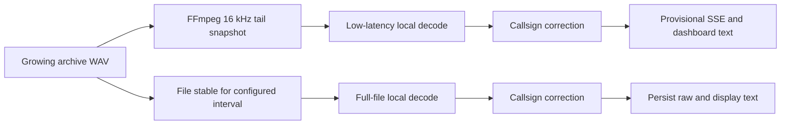

# AI transcription

Repeater Scribe uses `faster-whisper` for automatic speech recognition (ASR).
The production backend is fully local: WAV audio and transcript text are not
sent to OpenAI or another hosted transcription service. The model is downloaded
once into `ASLT_WHISPER_MODEL_DIR` and reused from that local cache.

There is currently no OpenAI transcription adapter. Supplying an OpenAI API key
does not change the transcription path. The `TranscriptionEngine` interface
allows an explicitly configured remote backend to be added later without
changing archive ingestion, but that is future work.

## Current two-pass pipeline



Both passes share one lazily loaded `FasterWhisperEngine` and one model in
memory. Inference is serialized so live and final work cannot load competing
copies into VRAM.

### Provisional pass

When `ASLT_LIVE_TRANSCRIPTION=true`, Repeater Scribe examines archive files that
are still growing on every `ASLT_LIVE_POLL_SECONDS` cycle. A file is eligible
after it reaches `ASLT_LIVE_MIN_FILE_BYTES` and its size has changed since the
last live pass.

FFmpeg copies the last `ASLT_LIVE_WINDOW_SECONDS` of the growing file into a
temporary mono, 16 kHz, signed 16-bit PCM WAV. Whisper decodes that snapshot
with:

- `ASLT_LIVE_BEAM_SIZE` (normally `1`),
- VAD disabled,
- previous-text conditioning disabled, and
- hotwords disabled.

The result is callsign-corrected, merged with overlapping text from earlier
windows, held in memory, and published on `/api/v1/events` with
`"provisional": true`. The dashboard labels it provisional. Snapshot files are
removed after each attempt and the source archive remains read-only.

Provisional text can change, repeat a phrase, or briefly omit speech. It is not
written to the transcript table and is discarded when the completed recording
enters the final path.

### Final pass

The archive scanner considers a recording complete only after its size and
modification time remain unchanged for `ASLT_FILE_STABILIZATION_SECONDS`. With
`ASLT_AUTO_PROCESS=true`, the complete source WAV is then decoded from beginning
to end with:

- `ASLT_WHISPER_BEAM_SIZE` (normally `5`),
- `ASLT_WHISPER_VAD_FILTER` (normally `true`), and
- normal cross-segment text conditioning.

This is a new full-file decode, not a continuation of the provisional text.
The final raw model text and callsign-corrected display text replace the live
result and are persisted in SQLite.

## Deployed 12 GB GPU profile

The supplied `.env.example` targets the installed 12 GB NVIDIA GPU:

| Purpose | Setting | Value |
| --- | --- | --- |
| Model | `ASLT_WHISPER_MODEL` | `large-v3` |
| Device | `ASLT_WHISPER_DEVICE` | `cuda` |
| Compute | `ASLT_WHISPER_COMPUTE_TYPE` | `float16` |
| Final search | `ASLT_WHISPER_BEAM_SIZE` | `5` |
| Live search | `ASLT_LIVE_BEAM_SIZE` | `1` |
| Live tail | `ASLT_LIVE_WINDOW_SECONDS` | `12` |
| Live interval | `ASLT_LIVE_POLL_SECONDS` | `1.5` |

Docker Compose requests the GPU, and the image includes CUDA 12 cuBLAS and
cuDNN runtime libraries. The host must provide a compatible NVIDIA driver and
NVIDIA Container Toolkit. Confirm access from the running service with:

```bash
docker compose exec -T repeater-scribe nvidia-smi
```

For CPU-only operation, set `ASLT_WHISPER_DEVICE=cpu` and
`ASLT_WHISPER_COMPUTE_TYPE=int8`. `large-v3` can run on a CPU, but it is unlikely
to sustain near-live operation on typical hardware; `medium.en` is the practical
starting point for English-only CPU deployments.

## Callsign recognition

Callsign handling is a local post-decode stage. It deliberately does not assume
that a larger general speech model will spell every rapidly spoken callsign
correctly.

For every live or final pass, the candidate provider builds a relevance-ranked,
cached set from:

1. `ASLT_KNOWN_CALLSIGNS`,
2. favorite callsign overrides and favorite targets,
3. keyed or active favorite/node statistics, and
4. callsigns observed in the topology cache and its neighbors.

The resolver then:

- converts NATO and common amateur-radio phonetic words into symbols,
- accepts international prefix/digit/suffix formats such as `3DA0RS`, `9A1A`,
  and `VK2ABC`, while reducing portable forms such as `K7ABC/P` to their base call,
- joins split callsign pieces,
- tolerates short fillers, accented number forms such as `tree`, `fife`, and
  `niner`, and unique one-character misspellings of NATO phonetics,
- collapses multiple repeated symbols caused by doubled audio or speech only
  when the uncollapsed text is not already a valid callsign,
- repairs likely digit-slot errors such as `KDIDJ` to `KD1DJ`, and
- uses conservative weighted matching against locally relevant candidates for
  errors such as `AM7 VHS` to `KM7GHS`.

Successful QRZ lookups are also kept as high-relevance in-memory candidates.
This means that once a station has been identified and validated, later mumbled
or accented versions of that same call can be repaired locally without another
QRZ request. The normal QRZ result cache still controls remote lookup frequency.

Ambiguous matches are left unchanged. Candidate order is used only to break a
fuzzy tie when one callsign has a substantially stronger local prior. The
original model output is stored as `raw_text`; corrected operator-facing text is
stored as `display_text`. This makes every correction reviewable.

`ASLT_CALLSIGN_MAX_CANDIDATES` bounds the search set, while
`ASLT_CALLSIGN_CONTEXT_CACHE_SECONDS` controls how often database context is
refreshed. Add stable club and operator calls to `ASLT_KNOWN_CALLSIGNS`; active
network calls are discovered automatically.

The dashboard renders recognized callsigns as links inside each display
transcript. Selecting one opens and highlights its last-heard QRZ card. Each
card has a **Show transcript** action that returns to and highlights the source
recording, applying a source-path search if that recording is outside the
currently rendered transcript page.

### Prompts and hotwords

The shipped configuration leaves `ASLT_WHISPER_INITIAL_PROMPT` and
`ASLT_WHISPER_HOTWORDS` blank and sets `ASLT_CALLSIGN_HOTWORD_LIMIT=0`.
Dynamic candidates therefore influence post-decode correction without being
inserted into Whisper's prompt. Live decoding disables hotwords regardless of
that limit. This avoids candidate-list text appearing in provisional output.

Only enable a small positive hotword limit for a controlled A/B test using real
repeater audio. Do not place an FCC-wide callsign list in a prompt.

## Configuration reference

These are the environment variables read by the current transcription path:

| Setting | Shipped value | Effect |
| --- | --- | --- |
| `ASLT_WHISPER_MODEL` | `large-v3` | `faster-whisper` model identifier or local model path |
| `ASLT_WHISPER_DEVICE` | `cuda` | CTranslate2 inference device; use `cpu` for CPU-only operation |
| `ASLT_WHISPER_COMPUTE_TYPE` | `float16` | Inference precision/quantization; use `int8` for the CPU profile |
| `ASLT_WHISPER_MODEL_DIR` | `/data/models/whisper` | Persistent model download cache |
| `ASLT_WHISPER_LANGUAGE` | `en` | Fixed decode language used by both passes |
| `ASLT_WHISPER_BEAM_SIZE` | `5` | Final full-file search width |
| `ASLT_WHISPER_VAD_FILTER` | `true` | Enables VAD on the final pass only |
| `ASLT_WHISPER_INITIAL_PROMPT` | empty | Optional prompt passed directly to both Whisper passes |
| `ASLT_WHISPER_HOTWORDS` | empty | Optional final-pass hint text; nonempty text enables it |
| `ASLT_WORKER_CONCURRENCY` | `1` | CTranslate2 `cpu_threads`; inference itself remains serialized |
| `ASLT_KNOWN_CALLSIGNS` | site-specific | Highest-priority local callsign candidates |
| `ASLT_CALLSIGN_HOTWORD_LIMIT` | `0` | Number of ranked dynamic calls added to final-pass hotwords |
| `ASLT_CALLSIGN_MAX_CANDIDATES` | `250` | Maximum post-decode fuzzy candidates |
| `ASLT_CALLSIGN_CONTEXT_CACHE_SECONDS` | `30` | Dynamic candidate cache lifetime |
| `ASLT_AUTO_PROCESS` | `true` | Automatically runs the final pass for pending stable files |
| `ASLT_ARCHIVE_POLL_SECONDS` | `1` | Interval for archive discovery and final-job processing |
| `ASLT_FILE_STABILIZATION_SECONDS` | `5` | Required unchanged interval before final processing |
| `ASLT_LIVE_TRANSCRIPTION` | `true` | Enables provisional growing-file transcription |
| `ASLT_LIVE_POLL_SECONDS` | `1.5` | Interval between live-service checks |
| `ASLT_LIVE_WINDOW_SECONDS` | `12` | Tail duration copied into each temporary snapshot |
| `ASLT_LIVE_BEAM_SIZE` | `1` | Provisional decode search width |
| `ASLT_LIVE_MIN_FILE_BYTES` | `4096` | Minimum growing-file size before a live attempt |
| `ASLT_FFMPEG_BINARY` | `ffmpeg` | Snapshot executable |
| `ASLT_TMP_DIR` | `/tmp` | Parent for ephemeral live snapshot files |

The previous `ASLT_MIN_DURATION_SECONDS`, `ASLT_MAX_DURATION_SECONDS`, and
`ASLT_SILENCE_THRESHOLD` example entries were removed because the current
transcription runtime does not consume them. Duration and silence behavior are
currently determined by the archive file and Whisper/VAD configuration.

## Verification and tuning

Benchmark one or more real recordings with the effective local configuration:

```bash
docker compose run --rm repeater-scribe \
  asl-transcriber benchmark /audio/YOUR_NODE_ID/example.wav
```

The command reports audio duration, processing duration, real-time factor,
model/device settings, raw text, and corrected display text. A real-time factor
below `1.0` means that pass completed faster than the audio duration.

Measure ordinary word error rate separately from exact callsign accuracy. A
useful regression corpus should contain complete recordings with expected raw
speech and exact callsigns, including fast speech, phonetics, weak signals, and
squelch tails. Compare `raw_text` with `display_text` to audit the resolver.

Useful runtime checks:

```bash
docker compose ps
docker compose exec -T repeater-scribe nvidia-smi
docker compose logs --tail 200 repeater-scribe
curl http://localhost:8088/api/v1/system/info
```

If a completed recording is blank or partial, first confirm that the dashboard
status is `completed`, not `live`. Then benchmark that exact WAV. If the raw
audio contains speech but VAD removes it, temporarily compare a final pass with
`ASLT_WHISPER_VAD_FILTER=false`. Keep the change only if corpus measurements
show an improvement.

## Current limitations

- This is archive-tail transcription, not a direct PCM tap or true streaming
  decoder. Latency includes archive polling, snapshot creation, and inference.
- A snapshot of a file being written can fail; it is retried after a later size
  change.
- Provisional overlap merging is word-based and can duplicate or omit text.
- Callsign correction is probabilistic. Raw text is retained because corrected
  display text is not authoritative evidence of identity.
- A first-ever callsign that the speech model renders without enough phonetic or
  callsign structure cannot be recovered reliably from text alone. Add repeat
  stations to `ASLT_KNOWN_CALLSIGNS` and retain representative audio for corpus
  testing rather than enabling broad speculative substitutions.
- Segment timestamps and correction evidence exist in the in-process result but
  are not currently persisted in the transcript table.
- No remote or OpenAI transcription backend is implemented yet.
